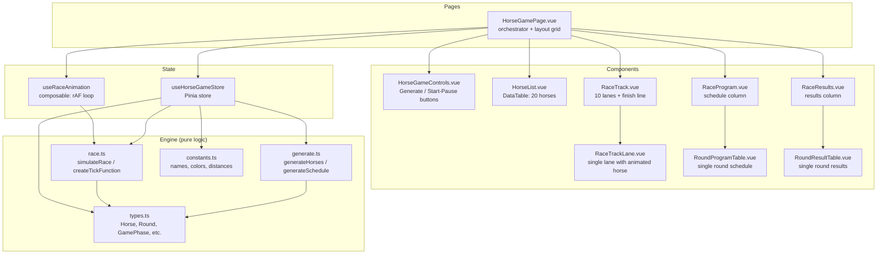
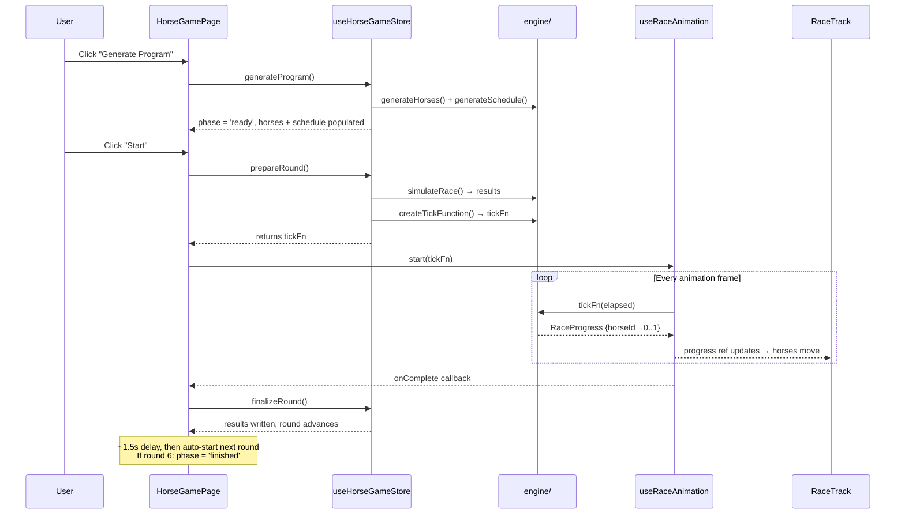

# Horse Racing Game — Implementation Plan

## Context

Building an interactive horse racing game per the trial task spec (`input/test_task.pdf`). The project scaffold (Vue 3 + Vite + PrimeVue + Pinia + Tailwind + FSD structure) is already in place. The feature slot at `src/features/horse-game/` has a placeholder page and empty component/composable dirs.

**Key adaptation from spec:** The PDF says "Vuex" but our project uses Pinia (per CLAUDE.md). We use Pinia.

**Decisions:**
- **Round flow:** Auto-advance — after each round finishes, ~1.5s pause then next round auto-starts. User can pause mid-race.
- **Horse visual:** SVG horse silhouette filled with the horse's color. One inline SVG component reused per lane.

---

## Architecture Diagram



## Data Flow



---

## Data Model (`types.ts`)

```ts
type Horse = { id: number, name: string, color: string, condition: number }
type RoundEntry = { horseId: number, position: number } // position=0 means unfinished
type Round = { roundNumber: number, distance: number, entries: RoundEntry[] }
type RaceProgress = { positions: Record<number, number> } // horseId → 0.0..1.0
type GamePhase = 'idle' | 'ready' | 'running' | 'paused' | 'finished'
```

---

## File Structure

All under `src/features/horse-game/`:

```
types.ts                          NEW — interfaces
engine/
  constants.ts                    NEW — HORSE_NAMES[20], HORSE_COLORS[20], ROUND_DISTANCES
  generate.ts                     NEW — generateHorses(), generateSchedule()
  generate.spec.ts                NEW — tests
  race.ts                         NEW — simulateRace(), createTickFunction()
  race.spec.ts                    NEW — tests
stores/
  useHorseGameStore.ts            NEW — Pinia store
  useHorseGameStore.spec.ts       NEW — tests
composables/
  useRaceAnimation.ts             NEW — rAF loop lifecycle (start/pause/resume/reset)
  useRaceAnimation.spec.ts        NEW — tests
pages/
  HorseGamePage.vue               REWRITE — full layout with grid
components/
  HorseGameControls.vue           NEW
  HorseList.vue                   NEW
  RaceTrack.vue                   NEW
  RaceTrackLane.vue               NEW
  RaceProgram.vue                 NEW
  RoundProgramTable.vue           NEW
  RaceResults.vue                 NEW
  RoundResultTable.vue            NEW
  HorseIcon.vue                   NEW — inline SVG horse silhouette
```

Also create: `src/tests/vitest.setup.ts` (empty, required by vitest config).

---

## Engine Design

### `generate.ts`
- `generateHorses()` → 20 horses with unique names (from constant pool), unique colors (from curated palette), random condition 1-100
- `generateSchedule(horses)` → 6 rounds, each randomly selects 10 of 20 horses, distances = [1200,1400,1600,1800,2000,2200]

### `race.ts`
- `simulateRace(round, horses)` → pre-compute finishing order. Algorithm: `raceTime = baseFactor / condition * distance + randomJitter`. Sort ascending → assign positions 1-10.
- `createTickFunction(round, horses, results)` → returns `(elapsedMs) => RaceProgress`. Winner finishes in ~5s, each subsequent position +200-400ms stagger. Ease-out curve: `1 - (1-t)^2`.

### Animation approach
- **`requestAnimationFrame`** loop in `useRaceAnimation` composable
- Store creates tick function from engine, page passes it to composable
- `RaceTrackLane` reads progress prop → `transform: translateX(${progress * maxWidth}px)`
- No CSS transitions needed — rAF at 60fps is inherently smooth
- Pause = cancel rAF + record elapsed. Resume = rAF with time offset.

---

## Store Design (`useHorseGameStore`)

**State:** `horses`, `schedule`, `currentRoundIndex`, `phase`, `raceProgress`
**Getters:** `currentRound`, `completedRounds`, `currentRoundHorses`, `isLastRound`
**Actions:** `generateProgram()`, `prepareRound()` → returns tickFn, `finalizeRound()`, `reset()`

The store stays pure (no rAF). The page component bridges store + animation composable.

---

## Component Responsibilities

| Component | Role |
|-----------|------|
| **HorseGamePage** | CSS grid layout (4 cols), wires store + animation, handles round lifecycle |
| **HorseGameControls** | Generate + Start/Pause buttons, reads `phase` for disable/label logic |
| **HorseList** | PrimeVue DataTable, 20 rows, color swatch column |
| **RaceTrack** | Current round label, 10 lanes, FINISH line |
| **RaceTrackLane** | SVG horse silhouette (filled with horse color), translateX by progress |
| **HorseIcon.vue** | Inline SVG horse silhouette, accepts `color` prop |
| **RaceProgram** | Scrollable list of 6 RoundProgramTable |
| **RoundProgramTable** | DataTable: position + name for 10 horses in a round |
| **RaceResults** | Scrollable list of 6 RoundResultTable |
| **RoundResultTable** | DataTable: finishing position + name, filled after round completes |

---

## Implementation Sequence

| Phase | Steps | What |
|-------|-------|------|
| 1 | 1-5 | **Data + Engine:** types, constants, generate, race + all specs |
| 2 | 6 | **Store:** Pinia store + spec |
| 3 | 7 | **Animation composable** + spec |
| 4 | 8-14 | **Components:** bottom-up, then page assembly |
| 5 | 15-17 | **Polish:** styling, edge cases, button states |

---

## Testing Strategy

**Target: 90% coverage** (per vitest config thresholds)

| File | Tests |
|------|-------|
| `generate.spec.ts` | 20 horses, unique IDs/names/colors, conditions 1-100, 6 rounds, 10 entries each, correct distances |
| `race.spec.ts` | 10 results with positions 1-10, condition→placement correlation (statistical), tick fn: progress 0→1 over time, monotonic, winner finishes first |
| `useHorseGameStore.spec.ts` | generateProgram sets state correctly, prepareRound returns function, finalizeRound advances round, phase transitions |
| `useRaceAnimation.spec.ts` | start/pause/resume lifecycle with fake timers + mocked rAF |

---

## Verification

1. `pnpm test` — all specs pass
2. `pnpm test:coverage` — meets 90% thresholds
3. `pnpm lint` — no errors
4. `pnpm build` — type-checks + builds successfully
5. `pnpm dev` — manual test:
   - Click "Generate Program" → horse list + program tables populate
   - Click "Start" → horses animate across track, round 1 results appear
   - Rounds auto-advance through 6
   - Click "Generate Program" again → resets everything
